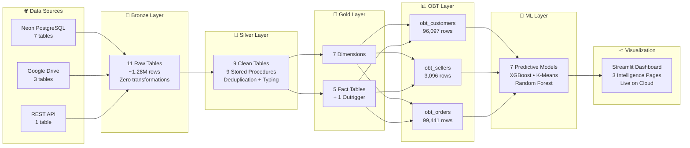
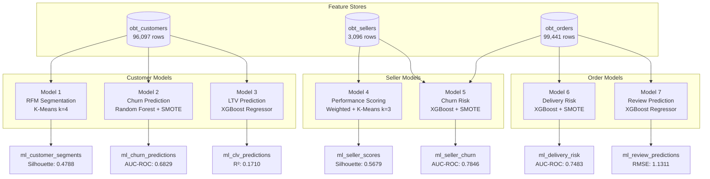

<div align="center">

# 🏭 Olist Data Warehouse & ML Analytics

### Production-Grade End-to-End Data Engineering & Machine Learning Pipeline

[](https://data-warehouse-from-scratch-gfmb6jraqdszq6tfzrm38q.streamlit.app/)
[](https://python.org)
[](https://www.microsoft.com/sql-server)
[](https://docs.microsoft.com/en-us/sql/t-sql/)
[](https://databricks.com/glossary/medallion-architecture)
[](https://www.kimballgroup.com)
[](https://xgboost.readthedocs.io/)
[](LICENSE)

🚀 **Live Dashboard:** [https://data-warehouse-from-scratch-gfmb6jraqdszq6tfzrm38q.streamlit.app/](https://data-warehouse-from-scratch-gfmb6jraqdszq6tfzrm38q.streamlit.app/)

> A complete, full-stack **Data Project** spanning **Data Engineering**, **Dimensional Modeling**, **Machine Learning**, and **Interactive Analytics**. Built using the **Medallion Architecture** (Bronze → Silver → Gold → ML), integrating two Olist datasets through an automated ELT pipeline into a Kimball-style **Galaxy Schema**, powering **7 predictive models** and a live **Streamlit dashboard**.

</div>

---

## 📋 Table of Contents

- [Project Overview](#-1-project-overview)
- [Architecture Overview](#-2-architecture-overview)
- [Tech Stack](#-3-tech-stack)
- [Project Structure](#-4-project-structure)
- [Data Sources](#-5-data-sources)
- [Medallion Architecture](#-6-medallion-architecture)
  - [Bronze Layer](#61-bronze-layer--ingestion)
  - [Silver Layer](#62-silver-layer--transformation)
  - [Gold Layer](#63-gold-layer--dimensional-modeling)
- [ELT Pipeline](#-7-elt-pipeline)
- [One Big Tables (OBTs)](#-8-one-big-tables-obts)
- [Machine Learning Pipeline](#-9-machine-learning-pipeline)
  - [Customer Models](#93-customer-models)
  - [Seller Models](#94-seller-models)
  - [Order Models](#95-order-models)
  - [Data Leakage Note](#96-data-leakage-note)
- [Streamlit Dashboard](#-10-streamlit-dashboard)
- [Gold Layer Data Governance](#-11-gold-layer-data-governance)
- [How To Run This Project](#-12-how-to-run-this-project)
- [Key Design Decisions](#-13-key-design-decisions)
- [Known Limitations & Future Work](#-14-known-limitations--future-work)
- [Dataset Credits](#-15-dataset-credits)

---

## 🎯 1. Project Overview

This project demonstrates a **production-grade, end-to-end data platform** — built entirely from scratch as an ITI (Information Technology Institute) graduation project. It covers the full lifecycle: from raw data ingestion through dimensional modeling, predictive ML, and interactive visualization.

**What was built:**

- **Automated ELT ingestion** of **~1.28 million rows** from 3 heterogeneous source systems (PostgreSQL, Google Drive, custom REST API)
- **9 idempotent T-SQL stored procedures** that clean, deduplicate, type-cast, and standardize raw data
- **Kimball Galaxy Schema** with **7 dimensions**, **5 fact tables**, and **1 outrigger** — fully enforced with foreign key constraints
- **3 One Big Tables** flattening the entire Gold layer into ML-ready feature stores (96,097 + 3,096 + 99,441 rows)
- **7 trained ML models** spanning segmentation, churn, LTV, performance scoring, delivery risk, and review prediction
- **Live Streamlit dashboard** with 3 intelligence pages and automatic Demo Mode for cloud deployment

**Key achievements:**

| Metric | Value |
|:---|:---|
| Total rows ingested | **~1,280,000** |
| Bronze tables | **11** |
| Silver tables | **9** |
| Gold tables | **13** (7 dims + 5 facts + 1 outrigger) |
| One Big Tables | **3** (Customers, Sellers, Orders) |
| ML models trained | **7** |
| ML result tables | **7** |
| Stored procedures | **19** (9 Silver + 9 Gold + 1 Gold Master) |
| Live dashboard pages | **3** |

---

## 🏗️ 2. Architecture Overview

The project follows the **Medallion Architecture** — progressively refining data quality and semantic richness across four layers.



<div align="center">
  
  <br>
  <em>End-to-end ELT data pipeline showing ingestion, transformation, and dimensional modeling.</em>
</div>

---

## 🛠️ 3. Tech Stack

| Category | Technology | Purpose |
|:---|:---|:---|
| **Languages** | Python 3.9+, T-SQL | Pipeline scripting and database transformations |
| **Database (Destination)** | Microsoft SQL Server 2022 | Data warehouse host |
| **Database (Source)** | Neon PostgreSQL (serverless) | Cloud-hosted e-commerce source data |
| **Data Architecture** | Medallion Architecture | Layered data quality refinement (Bronze/Silver/Gold/ML) |
| **Dimensional Modeling** | Kimball Galaxy Schema | Star schema with conformed shared dimensions |
| **ETL Patterns** | ELT, SCD Type 1, Accumulating Snapshot | Idempotent transformation patterns |
| **Python — Data** | `pandas`, `sqlalchemy`, `pyodbc` | DataFrame manipulation and DB connectivity |
| **Python — Ingestion** | `psycopg2`, `requests`, `python-dotenv` | Source system connectors |
| **ML — Classification** | XGBoost, Random Forest, scikit-learn | Churn, delivery risk, seller churn |
| **ML — Clustering** | K-Means (scikit-learn) | RFM segmentation, seller performance tiers |
| **ML — Regression** | XGBoost Regressor | CLV prediction, review score prediction |
| **ML — Imbalance** | imbalanced-learn (SMOTE) | Synthetic oversampling for minority classes |
| **Dashboard** | Streamlit, Plotly Express | Interactive multi-page analytics UI |
| **Cloud Deployment** | Streamlit Community Cloud | Free-tier hosting with automatic Demo Mode |
| **Cloud Services** | Google Drive API, Google Apps Script | File hosting and custom REST API |
| **Version Control** | Git + GitHub | Source code management |

---

## 📁 4. Project Structure

```
iti_grad_project/
│
├── ingestion/                              # 🥉 Bronze Layer — Python ELT scripts
│   ├── db_connections.py                   # Centralized connection helpers (Neon PG + SQL Server)
│   ├── ingest_neon_postgres.py             # Extract 7 tables from Neon PostgreSQL
│   ├── ingest_google_drive.py              # Download 3 tables from Google Drive/Sheets
│   ├── ingest_geolocation_api.py           # Stream ~855K rows from GAS REST API
│   ├── run_all_ingestion.py                # Orchestrator — runs all 3 pipelines
│   ├── data_validation.sql                 # Bronze quality profiling queries
│   └── README.md                           # Bronze ingestion documentation
│
├── scripts/
│   ├── silver/                             # 🥈 Silver Layer — T-SQL stored procedures
│   │   ├── load_customers.sql              # Bronze → Silver: customers
│   │   ├── load_sellers.sql                # Bronze → Silver: sellers
│   │   ├── load_products.sql               # Bronze → Silver: products + category translation
│   │   ├── load_orders.sql                 # Bronze → Silver: orders + sentinel dates
│   │   ├── load_order_items.sql            # Bronze → Silver: order line items
│   │   ├── load_order_payments.sql         # Bronze → Silver: payments + type mapping
│   │   ├── load_order_reviews.sql          # Bronze → Silver: reviews (dedup 559 duplicates)
│   │   ├── load_marketing_qualified_leads.sql  # Bronze → Silver: MQLs
│   │   ├── load_closed_deals.sql           # Bronze → Silver: closed deals
│   │   ├── silver_master.sql               # Master orchestrator (runs all 9 SPs)
│   │   ├── silver_quality_checks.sql       # Automated data quality audit
│   │   └── README.md                       # Silver layer documentation
│   │
│   ├── gold/                               # 🥇 Gold Layer — Kimball dimensional modeling
│   │   ├── gold_ddl_dimensions.sql         # DDL: all dimension tables + static seeds
│   │   ├── gold_ddl_facts.sql              # DDL: all fact tables + FK constraints
│   │   ├── gold_generate_dim_date.sql      # Populate dim_date (run once after DDL)
│   │   ├── gold_load_dim_customer.sql      # SP: MERGE → dim_customer
│   │   ├── gold_load_dim_product.sql       # SP: MERGE → dim_product
│   │   ├── gold_load_dim_seller.sql        # SP: MERGE → dim_seller
│   │   ├── gold_load_dim_marketing_channel.sql  # SP: MERGE → dim_marketing_channel
│   │   ├── gold_load_fact_order_items.sql   # SP: TRUNCATE + INSERT
│   │   ├── gold_load_fact_payments.sql      # SP: TRUNCATE + INSERT
│   │   ├── gold_load_fact_reviews.sql       # SP: reviews + outrigger
│   │   ├── gold_load_fact_order_life_cycle.sql  # SP: accumulating snapshot
│   │   ├── gold_load_fact_marketing_funnel.sql  # SP: TRUNCATE + INSERT
│   │   ├── gold_master.sql                 # Master orchestrator (runs all 9 load SPs)
│   │   └── README.md                       # Gold layer documentation
│   │
│   └── ml/                                 # 🤖 Machine Learning Layer
│       ├── create_obt_customers.py         # Build Customer OBT (96,097 rows)
│       ├── create_obt_sellers.py           # Build Seller OBT (3,096 rows)
│       ├── create_obt_orders.py            # Build Order OBT (99,441 rows)
│       ├── ml_customer_segments.py         # Model 1: RFM Segmentation (K-Means)
│       ├── ml_churn_predictions.py         # Model 2: Customer Churn (Random Forest)
│       ├── ml_clv_predictions.py           # Model 3: Customer LTV (XGBoost)
│       ├── ml_seller_scores.py             # Model 4: Seller Performance (K-Means)
│       ├── ml_seller_churn.py              # Model 5: Seller Churn Risk (XGBoost)
│       ├── ml_delivery_risk.py             # Model 6: Delivery Risk (XGBoost)
│       ├── ml_review_predictions.py        # Model 7: Review Prediction (XGBoost)
│       └── README.md                       # ML Pipeline documentation
│
├── streamlit/                              # 📈 Interactive Dashboard
│   ├── app.py                              # Main entry point / pipeline health overview
│   ├── pages/
│   │   ├── 1_Customer_Intelligence.py      # RFM + Churn + CLV tabs
│   │   ├── 2_Seller_Intelligence.py        # Performance + Churn tabs
│   │   └── 3_Order_Intelligence.py         # Delivery Risk + Reviews tabs
│   ├── components/
│   │   ├── db.py                           # Hybrid SQL/CSV data loader with Demo Mode
│   │   ├── charts.py                       # Reusable Plotly dark-themed chart functions
│   │   └── filters.py                      # Sidebar filter components
│   ├── assets/style.css                    # Custom dark theme CSS overrides
│   ├── data/                               # Pre-exported CSVs for Demo Mode (10 files)
│   ├── .streamlit/config.toml              # Streamlit theme configuration
│   └── README.md                           # Streamlit app documentation
│
├── docs/
│   ├── DataFlowDiagram.png                 # End-to-end architecture diagram
│   └── dwh_schema.png                      # Galaxy Schema ER diagram
│
├── metadata/
│   └── bronze_metdata.csv                  # Column-level metadata for all Bronze tables
│
├── geolocation_api.gs                      # Google Apps Script: serves geolocation as REST API
├── export_csv.py                           # Export Gold tables to CSV for Streamlit Demo Mode
├── requirements.txt                        # Python dependencies (ELT pipeline)
├── .env                                    # Environment variables (not committed)
├── .gitignore                              # Ignores venv, .env, __pycache__, *.csv
└── README.md                              # This file
```

---

## 📦 5. Data Sources

### 5.1 Brazilian E-Commerce Dataset

- **Source:** [Kaggle — Brazilian E-Commerce Public Dataset by Olist](https://www.kaggle.com/datasets/olistbr/brazilian-ecommerce)
- **Period:** 2016–2018
- **Description:** Real anonymized commercial data from the Olist marketplace containing 100K+ orders with multi-dimensional information on customers, products, sellers, payments, reviews, and geolocation.

| Table | Rows | Description |
|:---|:---|:---|
| `customers` | 99,441 | Customer profiles with city, state, and zip code |
| `orders` | 99,441 | Order-level timestamps and statuses |
| `order_items` | 112,650 | Line items linking orders to products and sellers |
| `order_payments` | 103,886 | Payment details with installments and amounts |
| `order_reviews` | 100,000 | Customer satisfaction scores (1–5) and free-text comments |
| `sellers` | 3,095 | Seller profiles with location data |
| `products` | 32,951 | Product catalog with categories and physical dimensions |
| `product_category_translation` | 71 | Portuguese-to-English category name mapping |
| `geolocation` | 855,781 | Latitude/longitude by zip code prefix |

### 5.2 Marketing Funnel Dataset

- **Source:** [Kaggle — Marketing Funnel by Olist](https://www.kaggle.com/datasets/olistbr/marketing-funnel-olist)
- **Description:** Records the marketing acquisition funnel — from first contact through MQL qualification to deal closure and seller onboarding.

| Table | Rows | Description |
|:---|:---|:---|
| `marketing_qualified_leads` | 8,000 | Leads who entered the marketing funnel |
| `closed_deals` | 842 | Successfully converted leads who became sellers |

### 5.3 How the Datasets Are Linked

The two datasets are bridged through **`seller_id`** — a shared key present in both `order_items` (e-commerce) and `closed_deals` (marketing). This enables cross-domain analysis:

```
E-Commerce: order_items.seller_id ──► dim_seller ◄── closed_deals.seller_id :Marketing
```

In the Gold layer, `dim_seller` is implemented as a **shared (conformed) dimension** — referenced by both `fact_order_items` and `fact_marketing_funnel`, making the Galaxy Schema possible.


---

## 🏗️ 6. Medallion Architecture

### 6.1 Bronze Layer — Ingestion

**Goal:** Extract data from all source systems and land it raw in the `bronze` schema with zero transformations. Every run is idempotent (Drop & Recreate).

| Pipeline | Source | Tables | Rows |
|:---|:---|:---|:---|
| `ingest_neon_postgres.py` | Neon PostgreSQL (SSL) | 7 | 449K+ |
| `ingest_google_drive.py` | Google Drive / Sheets | 3 | 109K+ |
| `ingest_geolocation_api.py` | Google Apps Script REST API | 1 | 855,781 |
| **Total** | — | **11** | **~1.28M rows** |

**Key engineering solutions:**

- **SQL Server 2100-parameter limit:** Resolved via `safe_chunk = floor(2000 / num_cols)` dynamic batching — splits large DataFrames into safe INSERT chunks automatically
- **Google Sheets detection:** `order_reviews` is stored as a Google Sheet; the script detects the Sheets URL pattern and uses the CSV export endpoint
- **SSL/TLS for Neon:** PostgreSQL connection uses `sslmode=require` to connect to the serverless cloud database
- **Audit columns:** Every row receives `_ingested_at` (DATETIME2), `_source` (VARCHAR), plus source-specific metadata

---

### 6.2 Silver Layer — Transformation

**Goal:** Transform raw Bronze data into clean, typed, and standardized tables using 9 idempotent T-SQL stored procedures.

**Execution:** `EXEC silver.silver_master;` (~15 seconds)

| # | Procedure | Silver Table | Rows |
|:---|:---|:---|:---|
| 1 | `silver.load_customers` | `silver.customers` | 99,441 |
| 2 | `silver.load_sellers` | `silver.sellers` | 3,095 |
| 3 | `silver.load_products` | `silver.products` | 32,951 |
| 4 | `silver.load_orders` | `silver.orders` | 99,441 |
| 5 | `silver.load_order_items` | `silver.order_items` | 112,650 |
| 6 | `silver.load_order_payments` | `silver.order_payments` | 103,886 |
| 7 | `silver.load_order_reviews` | `silver.order_reviews` | 99,441 |
| 8 | `silver.load_marketing_qualified_leads` | `silver.marketing_qualified_leads` | 8,000 |
| 9 | `silver.load_closed_deals` | `silver.closed_deals` | 842 |

**Transformation rules applied:**

| Rule | Implementation |
|:---|:---|
| **Deduplication** | `ROW_NUMBER() OVER (PARTITION BY <pk> ORDER BY _ingested_at DESC)` |
| **Whitespace cleaning** | `LTRIM(RTRIM(...))` on all string/ID columns |
| **NULL → Sentinel (dates)** | `'1900-01-01'` = data gap; `'9999-12-31'` = not yet occurred |
| **NULL → Sentinel (strings)** | FK strings → `'UNKNOWN'`; free text → `'No Title'`/`'No Message'` |
| **Type casting** | `TRY_CAST(... AS DATE)`, `CAST(... AS DECIMAL(10,2))` |
| **snake_case → Title Case** | `STRING_SPLIT` (ordinal) + `STRING_AGG` pipeline |
| **ZIP code zero-padding** | `RIGHT('00000' + CAST(zip AS VARCHAR(5)), 5)` |
| **Portuguese → English** | Product categories joined with translation table |
| **Financial precision** | All monetary columns cast to `DECIMAL(10,2)` |

**Data quality audit results:**
- ✅ **0 duplicates** on all primary keys across all 9 tables
- ✅ **0 unexpected NULLs** in key columns
- ✅ **559 review duplicates** correctly collapsed
- ✅ **8/8 ZIP codes** validated as 5-character zero-padded strings
- ✅ **7/8 FK relationships** fully resolved with 0 orphans
- ⚠️ **462 orphan rows** in `closed_deals → sellers` — handled via `-1` unknown member in Gold

---

### 6.3 Gold Layer — Dimensional Modeling

**Goal:** Build a Kimball-style **Galaxy Schema** — a shared dimensional model bridging e-commerce and marketing, fully enforced with foreign key constraints.

**Execution:** `EXEC gold.gold_master;`

<div align="center">
  
  <br>
  <em>Kimball Galaxy Schema — 7 Dimensions, 5 Fact Tables, 1 Outrigger</em>
</div>
<br>

```mermaid
erDiagram
    dim_date ||--o{ fact_order_items : "purchase_date_key"
    dim_date ||--o{ fact_payments : "purchase_date_key"
    dim_date ||--o{ fact_reviews : "review_creation_date_key"
    dim_date ||--o{ fact_order_life_cycle : "5 date keys"
    dim_date ||--o{ fact_marketing_funnel : "first_contact / won_date"

    dim_customer ||--o{ fact_order_items : "customer_sk"
    dim_customer ||--o{ fact_payments : "customer_sk"
    dim_customer ||--o{ fact_reviews : "customer_sk"
    dim_customer ||--o{ fact_order_life_cycle : "customer_sk"

    dim_product ||--o{ fact_order_items : "product_sk"
    dim_seller ||--o{ fact_order_items : "seller_sk"
    dim_seller ||--o{ fact_marketing_funnel : "seller_sk"

    dim_payment_type ||--o{ fact_payments : "payment_type_sk"
    dim_order_status ||--o{ fact_order_life_cycle : "order_status_sk"
    dim_marketing_channel ||--o{ fact_marketing_funnel : "mql_channel_sk"
    fact_reviews ||--|| review_comments : "review_sk"

    dim_customer {
        INT customer_sk PK
        VARCHAR customer_unique_id_bk
        CHAR customer_state
        VARCHAR customer_city
    }
    dim_seller {
        INT seller_sk PK
        VARCHAR seller_id_bk
        CHAR seller_state
        VARCHAR seller_city
    }
    dim_product {
        INT product_sk PK
        VARCHAR product_id_bk
        VARCHAR product_category_name
        INT product_weight_g
    }
    dim_date {
        INT date_key PK
        DATE full_date
        VARCHAR month_name
        SMALLINT year
    }
    fact_order_items {
        INT order_item_sk PK
        INT purchase_date_key FK
        INT customer_sk FK
        INT product_sk FK
        INT seller_sk FK
        DECIMAL unit_price
        DECIMAL line_total
    }
    fact_order_life_cycle {
        INT order_fulfillment_sk PK
        INT customer_sk FK
        INT order_status_sk FK
        INT days_to_deliver
        BIT is_delivered_on_time
    }
    fact_reviews {
        INT review_sk PK
        INT customer_sk FK
        TINYINT review_score
    }
    review_comments {
        INT review_sk PK_FK
        NVARCHAR review_comment_title
        NVARCHAR review_comment_message
    }
    fact_payments {
        INT payment_sk PK
        INT customer_sk FK
        INT payment_type_sk FK
        DECIMAL payment_value
        INT payment_installments
    }
    fact_marketing_funnel {
        INT closed_deal_sk PK
        INT seller_sk FK
        INT mql_channel_sk FK
        INT days_to_close
        DECIMAL declared_monthly_revenue
    }
```

**Dimensions (7 total):**

| Dimension | Grain | Strategy | Key |
|:---|:---|:---|:---|
| `dim_date` | One row per calendar day (2016–2020) | Recursive CTE, run once | `date_key` = YYYYMMDD |
| `dim_customer` | One row per unique customer | MERGE (SCD Type 1) | `customer_sk` |
| `dim_product` | One row per product | MERGE (SCD Type 1) | `product_sk` |
| `dim_seller` | One row per seller *(shared)* | MERGE (SCD Type 1) | `seller_sk` |
| `dim_payment_type` | One row per payment method (5) | Static seed | `payment_type_sk` |
| `dim_order_status` | One row per order status (8) | Static seed | `order_status_sk` |
| `dim_marketing_channel` | One row per MQL | MERGE (SCD Type 1) | `mql_channel_sk` |

**Fact Tables (5 total + 1 Outrigger):**

| Fact Table | Grain | Type | Rows |
|:---|:---|:---|:---|
| `fact_order_items` | One row per order line item | Transactional | 112,650 |
| `fact_payments` | One row per payment sequence | Transactional | 103,886 |
| `fact_reviews` | One row per order review | Transactional | 99,441 |
| `fact_order_life_cycle` | One row per order (all milestones) | Accumulating Snapshot | 99,441 |
| `fact_marketing_funnel` | One row per closed deal | Transactional | 842 |
| `review_comments` | 1:1 with `fact_reviews` | Outrigger | 99,441 |

---

## 🔄 7. ELT Pipeline

The entire pipeline runs end-to-end through **3 stages**, each executed with a single command:

```
┌────────────────────────────────────────────────────────────────────────────┐
│  Step 1: Bronze Ingestion (Python)                                        │
│  $ python ingestion/run_all_ingestion.py                                  │
│  → Extracts ~1.28M rows from 3 source systems into bronze schema          │
│  → Duration: ~5 minutes                                                   │
├────────────────────────────────────────────────────────────────────────────┤
│  Step 2: Silver Transformation (T-SQL)                                    │
│  > EXEC silver.silver_master;                                             │
│  → Runs 9 stored procedures in dependency order                           │
│  → Duration: ~15 seconds                                                  │
├────────────────────────────────────────────────────────────────────────────┤
│  Step 3: Gold Dimensional Load (T-SQL)                                    │
│  > EXEC gold.gold_master;                                                 │
│  → Loads 4 dimensions via MERGE, then 5 facts via TRUNCATE + INSERT       │
│  → Duration: ~30 seconds                                                  │
└────────────────────────────────────────────────────────────────────────────┘
```

**Orchestration:** Currently manual (single-command execution per layer). Designed for easy integration with Airflow or Prefect — each step is fully idempotent and re-runnable.

**Error handling:** Dimensions load before facts. If any single procedure fails, `THROW` in `BEGIN CATCH` halts the entire pipeline — no partial loads.

---

## 📊 8. One Big Tables (OBTs)

The OBT layer **flattens** the normalized Gold schema into wide, denormalized feature stores optimized for machine learning. Each OBT joins multiple dimensions and fact tables into a single table at a specific grain level.

| OBT | Grain | Rows | Columns | Purpose |
|:---|:---|:---|:---|:---|
| `gold.obt_customers` | One row per unique customer | **96,097** | 33 | Lifetime metrics, behavioral features, churn signals |
| `gold.obt_sellers` | One row per unique seller | **3,096** | 31 | Revenue, delivery, marketing acquisition features |
| `gold.obt_orders` | One row per unique order | **99,441** | 32 | Delivery timing, payment details, satisfaction features |

**Example — `obt_customers` feature categories:**

| Category | Features |
|:---|:---|
| **Monetary** | `total_spend`, `avg_order_value`, `max_order_value`, `total_freight_paid` |
| **Frequency** | `total_orders`, `total_items_bought`, `distinct_months_active` |
| **Recency** | `first_order_date`, `last_order_date`, `customer_tenure_days`, `days_since_last_order` |
| **Product** | `distinct_categories_bought`, `top_category`, `total_distinct_products` |
| **Delivery** | `avg_days_to_deliver`, `avg_days_to_approve`, `pct_late_deliveries` |
| **Satisfaction** | `avg_review_score`, `pct_1star_reviews`, `pct_5star_reviews`, `has_written_review` |
| **Marketing** | `any_seller_from_mql`, `mql_acquisition_channel` |

---

## 🤖 9. Machine Learning Pipeline

### 9.1 ML Architecture



### 9.2 Model Summary Table

| # | Model | Algorithm | Source OBT | Output Table | Key Metric | Score | Rows Scored |
|:---|:---|:---|:---|:---|:---|:---|:---|
| 1 | RFM Segmentation | K-Means (k=4) | `obt_customers` | `ml_customer_segments` | Silhouette | **0.4788** | 96,097 |
| 2 | Customer Churn | Random Forest + SMOTE | `obt_customers` | `ml_churn_predictions` | AUC-ROC | **0.6829** | 96,096 |
| 3 | Customer LTV | XGBoost Regressor | `obt_customers` | `ml_clv_predictions` | R² | **0.1710** | 95,135 |
| 4 | Seller Performance | Weighted Score + K-Means (k=3) | `obt_sellers` | `ml_seller_scores` | Silhouette | **0.5679** | 3,096 |
| 5 | Seller Churn | XGBoost + Dynamic SMOTE | `obt_sellers` + `obt_orders` | `ml_seller_churn` | AUC-ROC | **0.7846** | 3,096 |
| 6 | Delivery Risk | XGBoost + SMOTE | `obt_orders` | `ml_delivery_risk` | AUC-ROC | **0.7483** | 98,651 |
| 7 | Review Prediction | XGBoost Regressor | `obt_orders` | `ml_review_predictions` | RMSE | **1.1311** | 96,460 |

### 9.3 Customer Models

**Model 1 — RFM Segmentation (K-Means)**
Segments all 96,097 customers into 4 behavioral clusters based on Recency, Frequency, and Monetary quintile scores. Cluster labels: `Champions`, `Loyal Customers`, `At Risk`, `Lost/Inactive`. Silhouette score of 0.4788 indicates well-separated clusters.

**Model 2 — Customer Churn Prediction (Random Forest)**
Binary classifier predicting whether a customer will churn (no purchase in 120+ days). Uses SMOTE to balance the dataset from 64k/12k to 64k/64k. Outputs three risk tiers: `High` (>0.7), `Medium` (0.4–0.7), `Low` (<0.4). AUC-ROC of 0.6829 — acceptable given the single-purchase-dominant marketplace.

**Model 3 — Customer Lifetime Value (XGBoost Regressor)**
Predicts total expected customer spend using only non-leaking features: `total_orders`, `customer_tenure_days`, `distinct_months_active`, `avg_installments`, `distinct_categories_bought`, `pct_late_deliveries`, `avg_review_score`, `any_seller_from_mql`. R² of 0.1710 is honest and leakage-free. Tier labels: `Platinum` (top 10%), `Gold` (10-30%), `Silver` (30-60%), `Bronze` (bottom 40%).

### 9.4 Seller Models

**Model 4 — Seller Performance Scoring (Weighted Composite + K-Means)**
Builds a composite performance score: 40% `avg_review_score` + 30% `pct_on_time` + 20% `log(total_revenue)` + 10% `pct_5star_reviews`. K-Means clusters sellers into `Top Performer`, `Average Seller`, and `Underperformer` tiers with a silhouette score of 0.5679.

**Model 5 — Seller Churn Risk (XGBoost)**
Predicts which sellers will stop fulfilling orders (no activity in 180+ days anchored to dataset max timestamp). Uses dynamic SMOTE that auto-adjusts `k_neighbors` for small minority classes. AUC-ROC of 0.7846 — the strongest classifier in the pipeline.

### 9.5 Order Models

**Model 6 — Delivery Delay Risk (XGBoost)**
Predicts whether an order will miss its estimated delivery date. Features include `total_order_value`, `avg_product_weight_g`, `seller_pct_late_deliveries`, and `primary_category_encoded`. AUC-ROC of 0.7483 with SMOTE for class balance.

**Model 7 — Review Score Prediction (XGBoost Regressor)**
Forecasts expected customer satisfaction (1–5 stars) upon delivery. Key features: `c_scheduled_vs_actual_days`, `is_late`, `total_items`, `total_freight_value`. RMSE of 1.1311 — inherently limited by the subjectivity of human ratings. Predictions rounded to nearest 0.5.

### 9.6 Data Leakage Note

> **This section demonstrates ML maturity — recognizing and fixing data leakage.**

The initial Customer LTV model achieved an **R² of 0.9982** — suspiciously perfect. Investigation revealed that `avg_order_value` and `max_order_value` were near-perfect derivations of the target variable `total_spend`, constituting **direct target leakage**.

**Action taken:**
- Removed `avg_order_value`, `max_order_value`, and all monetary features that are algebraic transformations of `total_spend`
- Retrained with only behavioral features (order frequency, tenure, engagement, delivery experience)
- R² dropped to **0.1710** — an honest, production-realistic score for CLV prediction
- Feature importances confirmed `avg_installments` and `total_orders` as the top predictors

This fix was applied before any downstream consumption, ensuring all predictions in the dashboard are trustworthy.

---

## 📈 10. Streamlit Dashboard

🚀 **Live at:** [https://data-warehouse-from-scratch-gfmb6jraqdszq6tfzrm38q.streamlit.app/](https://data-warehouse-from-scratch-gfmb6jraqdszq6tfzrm38q.streamlit.app/)

The dashboard is a fully rebuilt, premium Streamlit application consuming exclusively the Gold layer ML result tables and OBTs via pre-exported CSV snapshots. Zero writes to the database.

### Pages

| Page | Tabs | Models |
|:---|:---|:---|
| **Home** | Overview · Model Registry · Nav Cards | All 7 |
| **Customer Intelligence** | RFM Segments · Churn Prediction · Lifetime Value | Models 1, 2, 3 |
| **Seller Intelligence** | Performance Scoring · Churn Risk | Models 4, 5 |
| **Order Intelligence** | Delivery Risk · Review Prediction | Models 6, 7 |

### Design System

- **Theme:** Deep dark (`#09090B`) with violet/cyan gradient branding
- **Charts:** Plotly with transparent backgrounds, semantic color palettes keyed to exact ML label strings
- **Scatter plots:** Auto-sampled to 5,000 rows to prevent browser overload across 96k+ datasets
- **Animations:** CSS `riseIn` stagger on metric cards and chart containers
- **Layout:** Multi-tab pages with sidebar filters (multiselect + range sliders) and CSV export per section

### CSV Fallback (Demo Mode)

`components/db.py` attempts a live SQL Server connection first; if unavailable (Streamlit Cloud),
it automatically loads the 10 pre-exported CSV files from `streamlit/data/`. No secrets or
environment variables are required for the cloud deployment to work.

### Run Locally

```bash
# From the project root
cd streamlit
pip install -r requirements.txt
streamlit run app.py
# Opens at http://localhost:8501
```

### Deploy to Streamlit Community Cloud

**Step 1 — Force-commit the CSV snapshots** (they are gitignored by default):

```bash
git add -f streamlit/data/*.csv
git commit -m "feat: add CSV snapshots for Streamlit Cloud deployment"
git push
```

**Step 2 — Create a new app** at [share.streamlit.io](https://share.streamlit.io):

| Field | Value |
|:---|:---|
| Repository | `your-github-username/data-warehouse-from-scratch` |
| Branch | `main` |
| **Main file path** | `streamlit/app.py` |
| App URL | Choose a custom slug |

**Step 3 — No secrets needed.** The CSV fallback activates automatically when no DB host is set.
Click **Deploy** — the app will be live in ~1–2 minutes.

**Refreshing data after a pipeline re-run:**

```bash
python export_csv.py          # Re-export from Gold layer
git add -f streamlit/data/*.csv
git commit -m "chore: refresh ML data snapshots"
git push                      # Streamlit Cloud auto-redeploys
```

> See [`streamlit/README.md`](streamlit/README.md) for full deployment reference.

---

## 🔒 11. Gold Layer Data Governance

### Read-Only Tables (Do Not Modify)

All original Gold dimensional and fact tables are **strictly read-only** within the ML and Streamlit environments:

| Schema | Tables | Count |
|:---|:---|:---|
| `gold` — Dimensions | `dim_date`, `dim_customer`, `dim_product`, `dim_seller`, `dim_payment_type`, `dim_order_status`, `dim_marketing_channel` | 7 |
| `gold` — Facts | `fact_order_items`, `fact_payments`, `fact_reviews`, `review_comments`, `fact_order_life_cycle`, `fact_marketing_funnel` | 6 |

### Write Tables (ML Pipeline Output)

Only these 10 tables are created/written by the ML scripts:

| Table | Writer Script | Pattern |
|:---|:---|:---|
| `gold.obt_customers` | `create_obt_customers.py` | TRUNCATE + INSERT |
| `gold.obt_sellers` | `create_obt_sellers.py` | TRUNCATE + INSERT |
| `gold.obt_orders` | `create_obt_orders.py` | TRUNCATE + INSERT |
| `gold.ml_customer_segments` | `ml_customer_segments.py` | TRUNCATE + INSERT |
| `gold.ml_churn_predictions` | `ml_churn_predictions.py` | TRUNCATE + INSERT |
| `gold.ml_clv_predictions` | `ml_clv_predictions.py` | TRUNCATE + INSERT |
| `gold.ml_seller_scores` | `ml_seller_scores.py` | TRUNCATE + INSERT |
| `gold.ml_seller_churn` | `ml_seller_churn.py` | TRUNCATE + INSERT |
| `gold.ml_delivery_risk` | `ml_delivery_risk.py` | TRUNCATE + INSERT |
| `gold.ml_review_predictions` | `ml_review_predictions.py` | TRUNCATE + INSERT |

### Transaction Safety

Every ML script follows the same idempotent execution pattern:

```sql
BEGIN TRY
    BEGIN TRAN;
    TRUNCATE TABLE gold.[target_table];
    -- Bulk Insert via pandas to_sql
    COMMIT TRAN;
END TRY
BEGIN CATCH
    ROLLBACK TRAN;
END CATCH
```

### Dry-Run vs `--execute`

All scripts are **dry-run by default** — they query data, train models, and print performance diagnostics without writing anything to the database. To commit results:

```bash
python scripts/ml/ml_customer_segments.py              # Dry run — prints diagnostics only
python scripts/ml/ml_customer_segments.py --execute     # Writes to gold.ml_customer_segments
```

---

## 🚀 12. How To Run This Project

### Prerequisites

- Python 3.9+
- Microsoft SQL Server 2022 (local instance, database named `BI_AI`)
- ODBC Driver 17 for SQL Server
- Git

### Step 1: Clone the Repository

```bash
git clone https://github.com/jagter4b/data-warehouse-from-scratch.git
cd data-warehouse-from-scratch
```

### Step 2: Set Up Virtual Environment

```bash
python -m venv venv
.\venv\Scripts\activate          # Windows
pip install -r requirements.txt
```

### Step 3: Configure Environment Variables

Create a `.env` file in the project root:

```env
# Source (Neon PostgreSQL)
SOURCE_DB_HOST=your-neon-host.neon.tech
SOURCE_DB_PORT=5432
SOURCE_DB_NAME=your_db_name
SOURCE_DB_USER=your_user
SOURCE_DB_PASSWORD=your_password
SOURCE_DB_SSL_MODE=require

# Destination (SQL Server)
DEST_DB_HOST=localhost
DEST_DB_PORT=1433
DEST_DB_NAME=BI_AI
DEST_DB_TRUSTED_CONNECTION=yes
```

### Step 4: Run the ELT Pipeline — Bronze Ingestion

```bash
python ingestion/run_all_ingestion.py
# Expected: ~1.28M rows loaded into [BI_AI].[bronze] in ~5 minutes
```

### Step 5: Build the Silver Layer

First run: Execute each `scripts/silver/load_*.sql` in SSMS to register the stored procedures, then:

```sql
USE [BI_AI];
EXEC silver.silver_master;
-- Expected: ~15 seconds, 559K rows processed
```

### Step 6: Build the Gold Layer

First run: Execute DDL scripts in order:
1. `scripts/gold/gold_ddl_dimensions.sql`
2. `scripts/gold/gold_generate_dim_date.sql`
3. `scripts/gold/gold_ddl_facts.sql`

Then for every refresh:

```sql
USE [BI_AI];
EXEC gold.gold_master;
```

### Step 7: Build the One Big Tables

```bash
python scripts/ml/create_obt_customers.py --execute
python scripts/ml/create_obt_sellers.py --execute
python scripts/ml/create_obt_orders.py --execute
```

### Step 8: Run the ML Pipeline

```bash
python scripts/ml/ml_customer_segments.py --execute
python scripts/ml/ml_churn_predictions.py --execute
python scripts/ml/ml_clv_predictions.py --execute
python scripts/ml/ml_seller_scores.py --execute
python scripts/ml/ml_seller_churn.py --execute
python scripts/ml/ml_delivery_risk.py --execute
python scripts/ml/ml_review_predictions.py --execute
```

### Step 9: Export CSVs for the Dashboard

```bash
# From the project root — exports all 10 Gold/ML tables to streamlit/data/
python export_csv.py
```

### Step 10: Launch Streamlit Dashboard

```bash
cd streamlit
pip install -r requirements.txt
streamlit run app.py
# Opens at http://localhost:8501
```

---

## 🧠 13. Key Design Decisions

| Decision | Rationale |
|:---|:---|
| **Medallion Architecture** | Progressive data quality refinement — raw landing (Bronze), clean typed (Silver), business-ready (Gold). Each layer is independently testable and re-runnable. |
| **Kimball Galaxy Schema** | Conformed dimensions shared across two subject areas (e-commerce + marketing) — more flexible than a single star schema for cross-domain analysis. |
| **ELT over ETL** | Leverage SQL Server's compute engine for transformations. Land data raw first to preserve full lineage. |
| **OBTs as ML Feature Stores** | One Big Tables denormalize the Galaxy Schema into flat, wide tables — eliminating complex joins at training time and ensuring reproducible feature sets. |
| **XGBoost for classification/regression** | Industry-standard gradient boosting with built-in regularization. Handles mixed feature types, missing values, and non-linear relationships well. |
| **Churn anchor = max dataset timestamp** | The dataset is from 2016–2018. Using `GETDATE()` would make every customer appear churned. Anchoring to the latest observed date preserves realistic churn labels. |
| **Leakage features removed from CLV** | `avg_order_value` = `total_spend / total_orders` — a direct algebraic derivation of the target. Removing it dropped R² from 0.9982 to 0.1710 but ensured honest predictions. |
| **Demo Mode for Streamlit** | The source database is a local SQL Server instance. Rather than requiring VPN tunnels or cloud migrations, the app gracefully degrades to pre-exported CSVs for cloud hosting. |
| **Idempotency everywhere** | Every script is re-runnable safely — no manual cleanup required. Bronze: DROP+CREATE. Silver: TRUNCATE+INSERT. Gold: MERGE or TRUNCATE+INSERT. ML: TRUNCATE+INSERT. |
| **Context-aware sentinels** | Distinguish between "data missing" (`1900-01-01`) and "not yet occurred" (`9999-12-31`). Lag measures are NULL when either boundary is a sentinel. |

---

## ⚠️ 14. Known Limitations & Future Work

### Known Limitations

| Limitation | Impact |
|:---|:---|
| **Dataset is from 2016–2018** | All models are trained on historical data; concept drift is expected in production |
| **CLV R² = 0.1710** | Honest, leakage-free — but limited predictive power due to single-purchase marketplace behavior |
| **Customer Churn AUC = 0.6829** | Acceptable but not strong — ~75% of Olist customers make only 1 purchase, limiting churn signals |
| **Review RMSE = 1.1311** | Inherently bounded by the subjectivity of human satisfaction ratings |
| **Local SQL Server** | Not cloud-hosted; requires ODBC Driver 17 and Windows Authentication — dashboard uses CSV fallback on Streamlit Cloud |
| **462 orphan sellers** | `closed_deals` references sellers not in the e-commerce dataset — handled via unknown member |
| **CSV data freshness** | Streamlit Cloud serves pre-exported CSVs; data is a static snapshot unless `export_csv.py` is re-run and pushed |

### Future Work

| Enhancement | Description |
|:---|:---|
| **Airflow / Prefect orchestration** | Replace manual pipeline execution with scheduled DAGs |
| **MLflow model tracking** | Version models, log hyperparameters, and compare experiments |
| **Feature Store versioning** | Timestamp OBT snapshots for point-in-time training reproducibility |
| **Real-time scoring API** | Serve models via FastAPI for on-demand predictions |
| **Cloud migration** | Move data warehouse to Azure SQL Database or Snowflake |
| **NLP on review comments** | Sentiment analysis on `review_comments.review_comment_message` for richer satisfaction modeling |
| **A/B testing framework** | Compare model versions (e.g., Random Forest vs XGBoost for churn) with hold-out evaluation |
| **Power BI dashboards** | Add traditional BI reporting layer consuming the Gold Galaxy Schema |
| **Geolocation enrichment** | Incorporate the 855K-row geolocation table for delivery distance features |

---

## 📄 15. Dataset Credits

- **Brazilian E-Commerce Public Dataset by Olist** — [Kaggle](https://www.kaggle.com/datasets/olistbr/brazilian-ecommerce)
- **Marketing Funnel by Olist** — [Kaggle](https://www.kaggle.com/datasets/olistbr/marketing-funnel-olist)

> This is a public dataset released by Olist for educational and research purposes. No personally identifiable information (PII) is contained in the data. All customer, seller, and product identifiers are anonymized hashes.

---

## 📚 Layer Documentation

Each layer has its own detailed README with full schema references and design decisions:

| Layer | Documentation |
|:---|:---|
| **Bronze** | [`ingestion/README.md`](ingestion/README.md) |
| **Silver** | [`scripts/silver/README.md`](scripts/silver/README.md) |
| **Gold** | [`scripts/gold/README.md`](scripts/gold/README.md) |
| **ML** | [`scripts/ml/README.md`](scripts/ml/README.md) |
| **Streamlit** | [`streamlit/README.md`](streamlit/README.md) |

---

<div align="center">

Built with ❤️ using Python, SQL Server, XGBoost, and Streamlit

*ITI (Information Technology Institute) — Graduation Project*

🚀 **Live Demo:** [https://data-warehouse-from-scratch-gfmb6jraqdszq6tfzrm38q.streamlit.app/](https://data-warehouse-from-scratch-gfmb6jraqdszq6tfzrm38q.streamlit.app/)

📖 **Deployment Guide:** [`streamlit/README.md`](streamlit/README.md)

</div>
