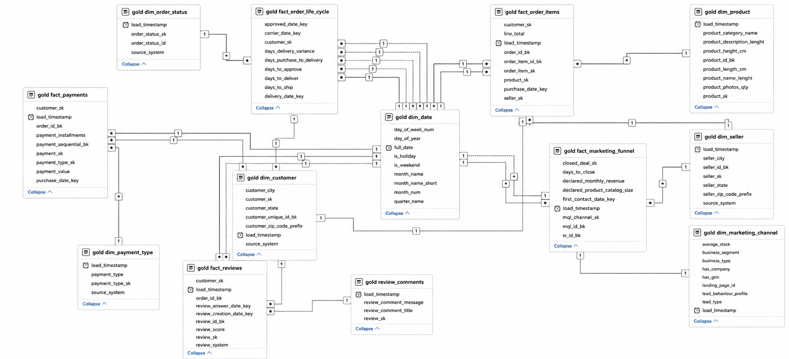

# 🏭 Olist Data Warehouse — From Scratch

> A production-grade, end-to-end **Data Warehouse** built using the **Medallion Architecture** (Bronze → Silver → Gold), integrating two Olist datasets through an automated ELT pipeline into a Kimball-style **Galaxy Schema** optimized for analytical reporting in Power BI.

[](https://python.org)
[](https://www.microsoft.com/sql-server)
[](https://docs.microsoft.com/en-us/sql/t-sql/)
[](https://databricks.com/glossary/medallion-architecture)
[](https://www.kimballgroup.com)

---

## 📋 Table of Contents

- [Project Overview](#-project-overview)
- [Datasets](#-datasets)
- [Architecture](#️-architecture)
- [Bronze Layer — Ingestion](#-bronze-layer--ingestion)
- [Silver Layer — Transformation](#️-silver-layer--transformation)
- [Gold Layer — Dimensional Modeling](#-gold-layer--dimensional-modeling)
- [Schema Diagram](#-schema-diagram)
- [Repository Structure](#-repository-structure)
- [Getting Started](#-getting-started)
- [Tech Stack](#️-tech-stack)
- [Roadmap](#-roadmap)

---

## 🎯 Project Overview

This project demonstrates a complete **Data Engineering pipeline** from raw source data to an analytics-ready dimensional model. It was built as a graduation project for ITI (Information Technology Institute), showcasing real-world data warehousing skills.

**What was built:**

- **Automated ingestion** of ~1.28 million rows from 3 heterogeneous source systems (PostgreSQL, Google Drive, and a custom REST API)
- **9 idempotent T-SQL stored procedures** that clean, deduplicate, and standardize raw data
- **Kimball Galaxy Schema** with 7 dimensions, 5 fact tables, and 1 outrigger — fully enforced with foreign key constraints
- A **master orchestration layer** that runs the entire pipeline end-to-end with a single stored procedure call

**Key engineering decisions:**

| Decision | Rationale |
|:---|:---|
| **ELT over ETL** | Leverage SQL Server's compute for transformations; land raw data first for full lineage |
| **Idempotency everywhere** | Every script is re-runnable safely — no manual cleanup required |
| **Kimball Galaxy Schema** | Conformed dimensions shared between two subject areas (e-commerce + marketing) |
| **Context-aware sentinels** | Distinguish between "data missing" (`1900-01-01`) and "not yet occurred" (`9999-12-31`) |
| **Brazilian locale preservation** | All string columns kept as `NVARCHAR` to retain ã, ç, é, and other accented characters |

---

## 📦 Datasets

Two public Kaggle datasets from Olist, a Brazilian e-commerce company:

| Dataset | Source | Tables | Description |
|:---|:---|:---|:---|
| [Brazilian E-Commerce](https://www.kaggle.com/datasets/olistbr/brazilian-ecommerce) | Neon PostgreSQL + Google Drive | 9 tables | Orders, customers, products, sellers, payments, reviews, geolocation |
| [Marketing Funnel](https://www.kaggle.com/datasets/olistbr/marketing-funnel-olist) | Google Drive | 2 tables | Marketing Qualified Leads (MQLs) and closed deals |

The datasets are linked through `seller_id` — enabling cross-domain analysis between sales performance and marketing acquisition channels.

---

## 🏗️ Architecture

The project follows the **Medallion Architecture** — a layered data engineering pattern that progressively refines data quality and semantic richness.

```
┌─────────────────────────────────────────────────────────────────┐
│                        SOURCE SYSTEMS                           │
│  ┌──────────────┐   ┌──────────────────┐   ┌────────────────┐  │
│  │ Neon Postgres│   │  Google Drive /  │   │  Google Apps   │  │
│  │  (7 tables)  │   │  Sheets (3 tbls) │   │  Script API    │  │
│  └──────┬───────┘   └────────┬─────────┘   └───────┬────────┘  │
└─────────┼────────────────────┼─────────────────────┼───────────┘
          │                    │                      │
          ▼  Python (ELT)      ▼                      ▼
┌─────────────────────────────────────────────────────────────────┐
│  🥉 BRONZE  [BI_AI].[bronze]  — Raw / As-Is                     │
│  11 tables │ ~1.28M rows │ Full audit columns (_ingested_at)    │
└────────────────────────┬────────────────────────────────────────┘
                         │  T-SQL Stored Procedures
                         ▼
┌─────────────────────────────────────────────────────────────────┐
│  🥈 SILVER  [BI_AI].[silver]  — Cleaned / Standardized          │
│  9 tables │ 559K rows │ Deduped, typed, sentinel-filled         │
└────────────────────────┬────────────────────────────────────────┘
                         │  T-SQL Stored Procedures
                         ▼
┌─────────────────────────────────────────────────────────────────┐
│  🥇 GOLD  [BI_AI].[gold]  — Analytics-Ready Galaxy Schema        │
│  7 dimensions │ 5 fact tables │ 1 outrigger │ FK constraints    │
└─────────────────────────────────────────────────────────────────┘
                         │
                         ▼
                  📊 Power BI Reports
```

---

## 🥉 Bronze Layer — Ingestion

**Goal:** Extract data from all source systems and land it raw in the `bronze` schema with zero transformations. Every run is idempotent (Drop & Recreate).

### Source Systems & Results

| Pipeline | Source | Tables | Rows | Duration |
|:---|:---|:---|:---|:---|
| `ingest_neon_postgres.py` | Neon PostgreSQL (SSL) | 7 | customers (99K), orders (99K), items (112K), payments (103K), sellers (3K), products (32K), translations (71) | 159.2s |
| `ingest_google_drive.py` | Google Drive / Sheets | 3 | closed_deals (842), MQLs (8K), order_reviews (100K) | 93.3s |
| `ingest_geolocation_api.py` | Google Apps Script REST API | 1 | geolocation (**855,781 rows**, 52MB) | 53.5s |
| **Total** | — | **11** | **~1.28 million rows** | **306s** |

### Key Engineering Solutions

- **SQL Server 2100-parameter limit**: Resolved via `safe_chunk = floor(2000 / num_cols)` dynamic batching — splits large DataFrames into safe INSERT chunks automatically
- **Google Sheets detection**: `order_reviews` is stored as a Google Sheet; the ingestion script detects the Sheets URL pattern and uses the CSV export endpoint
- **SSL/TLS for Neon**: PostgreSQL connection uses `sslmode=require` to connect to the serverless Neon cloud database
- **Audit columns**: Every row receives `_ingested_at` (DATETIME2), `_source` (VARCHAR), plus source-specific metadata fields

### Ingestion Scripts

| File | Purpose |
|:---|:---|
| `ingestion/db_connections.py` | Centralized connection helpers for Neon PostgreSQL and local SQL Server |
| `ingestion/ingest_neon_postgres.py` | Pulls 7 e-commerce tables from cloud PostgreSQL |
| `ingestion/ingest_google_drive.py` | Downloads 3 tables from Google Drive/Sheets via API |
| `ingestion/ingest_geolocation_api.py` | Streams ~855K rows from the Google Apps Script geolocation endpoint |
| `ingestion/run_all_ingestion.py` | Orchestrator — runs all 3 pipelines sequentially with timing |
| `geolocation_api.gs` | Google Apps Script that serves geolocation CSV data as a REST API |

---

## 🥈 Silver Layer — Transformation

**Goal:** Transform raw Bronze data into clean, typed, and standardized tables using idempotent T-SQL stored procedures. Single master call runs all 9 procedures in the correct dependency order.

**Execution:** `EXEC silver.silver_master;` (~15 seconds)

### Pipeline Results

| # | Procedure | Silver Table | Rows | Duration |
|:---|:---|:---|:---|:---|
| 1 | `silver.load_customers` | `silver.customers` | 99,441 | 10s |
| 2 | `silver.load_sellers` | `silver.sellers` | 3,095 | 1s |
| 3 | `silver.load_products` | `silver.products` | 32,951 | <1s |
| 4 | `silver.load_orders` | `silver.orders` | 99,441 | 1s |
| 5 | `silver.load_order_items` | `silver.order_items` | 112,650 | 1s |
| 6 | `silver.load_order_payments` | `silver.order_payments` | 103,886 | 1s |
| 7 | `silver.load_order_reviews` | `silver.order_reviews` | 99,441 | 1s |
| 8 | `silver.load_marketing_qualified_leads` | `silver.marketing_qualified_leads` | 8,000 | <1s |
| 9 | `silver.load_closed_deals` | `silver.closed_deals` | 842 | <1s |

> `geolocation` is intentionally excluded — not part of the Galaxy Schema.

### Transformation Rules

| Rule | Implementation |
|:---|:---|
| **Deduplication** | `ROW_NUMBER() OVER (PARTITION BY <pk> ORDER BY _ingested_at DESC)` — most recent ingestion wins |
| **Whitespace cleaning** | `LTRIM(RTRIM(...))` on all string/ID columns |
| **NULL → Sentinel (dates)** | `'1900-01-01'` = data quality gap; `'9999-12-31'` = still in transit/not yet occurred |
| **NULL → Sentinel (strings)** | FK strings → `'UNKNOWN'`; free text → `'No Title'`/`'No Message'`; categoricals → `'Not Specified'` |
| **Type casting** | `TRY_CAST(... AS DATE)`, `CAST(... AS DECIMAL(10,2))`, `CAST(... AS TINYINT)` |
| **snake_case → Title Case** | `STRING_SPLIT` (ordinal) + `STRING_AGG` pipeline — SQL Server 2022+ |
| **ZIP code zero-padding** | `RIGHT('00000' + CAST(zip AS VARCHAR(5)), 5)` — e.g. `1151` → `'01151'` |
| **Portuguese → English** | Product categories joined with translation table → human-readable English Title Case |
| **Financial precision** | All monetary columns cast to `DECIMAL(10,2)` |
| **Source typo fixes** | `product_name_lenght` → `product_name_length`, `freight_value` → `unit_freight_value` |

### Data Quality Audit

A comprehensive audit (`silver_quality_checks.sql`) was run post-load and validated:

- ✅ **0 duplicates** on all primary keys across all 9 tables
- ✅ **0 unexpected NULLs** in key columns
- ✅ **559 review duplicates** correctly collapsed (99,441 clean rows)
- ✅ **8/8 ZIP codes** validated as 5-character zero-padded strings
- ✅ **7/8 FK relationships** fully resolved with 0 orphans
- ⚠️ **462 orphan rows** in `closed_deals → sellers` — a known source data issue (MQLs converted by sellers who later left the platform), handled gracefully in the Gold layer via `-1` unknown member

---

## 🥇 Gold Layer — Dimensional Modeling

**Goal:** Build a Kimball-style **Galaxy Schema** — a shared dimensional model bridging e-commerce operations and marketing funnel analytics. Fully enforced with foreign key constraints.

**Execution:** `EXEC gold.gold_master;`

### Schema Overview

```
                    ┌─────────────┐
                    │  dim_date   │ (conformed — shared by all facts)
                    └──────┬──────┘
                           │
          ┌────────────────┼────────────────┐
          │                │                │
    ┌─────▼──────┐  ┌──────▼──────┐  ┌─────▼──────────┐
    │ dim_customer│  │ dim_product │  │   dim_seller   │ ← SHARED
    └─────────────┘  └─────────────┘  └────────┬───────┘
                                               │
   E-Commerce Facts:                           │  Marketing Facts:
   ┌─────────────────────┐         ┌───────────▼──────────┐
   │  fact_order_items   │         │ fact_marketing_funnel │
   │  fact_payments      │         └──────────────────────┘
   │  fact_reviews ──────┼──► review_comments (outrigger)
   │  fact_order_life_   │
   │    cycle            │
   └─────────────────────┘
        │
   ┌────▼──────────────┐  ┌──────────────────────┐
   │ dim_payment_type  │  │  dim_marketing_channel│
   │ dim_order_status  │  └──────────────────────┘
   └───────────────────┘
```

### Dimensions (7 total)

| Dimension | Grain | Strategy | Load SP |
|:---|:---|:---|:---|
| `dim_date` | One row per calendar day (2016–2020) | Recursive CTE, run once | `gold_generate_dim_date.sql` |
| `dim_customer` | One row per unique customer | MERGE (SCD Type 1) | `gold.load_dim_customer` |
| `dim_product` | One row per product | MERGE (SCD Type 1) | `gold.load_dim_product` |
| `dim_seller` | One row per seller *(shared dimension)* | MERGE (SCD Type 1) | `gold.load_dim_seller` |
| `dim_payment_type` | One row per payment method (5 static) | Seeded in DDL | — |
| `dim_order_status` | One row per order status (8 static) | Seeded in DDL | — |
| `dim_marketing_channel` | One row per MQL | MERGE (SCD Type 1) | `gold.load_dim_marketing_channel` |

**Key design notes:**
- **`dim_seller` is a shared (conformed) dimension** — referenced by both `fact_order_items` (e-commerce) and `fact_marketing_funnel` (marketing), serving as the cross-domain link between datasets
- **`dim_date`** uses YYYYMMDD integer keys (`20170315`) — no IDENTITY needed; includes 2 sentinel rows: `19000101` (unknown) and `99991231` (open/future)
- All SCD Type 1 dimensions have an **unknown member** (`SK = -1`) for unresolvable foreign keys

### Fact Tables (5 total)

| Fact Table | Grain | Type | Strategy | Load SP |
|:---|:---|:---|:---|:---|
| `fact_order_items` | One row per order line item | Transactional | TRUNCATE + INSERT | `gold.load_fact_order_items` |
| `fact_payments` | One row per payment sequence within an order | Transactional | TRUNCATE + INSERT | `gold.load_fact_payments` |
| `fact_reviews` | One row per order review | Transactional | Drop FK → TRUNCATE → Recreate FK → INSERT | `gold.load_fact_reviews` |
| `fact_order_life_cycle` | One row per order (all milestones) | **Accumulating Snapshot** | TRUNCATE + INSERT | `gold.load_fact_order_life_cycle` |
| `fact_marketing_funnel` | One row per closed deal | Transactional | TRUNCATE + INSERT | `gold.load_fact_marketing_funnel` |

**Notable design patterns:**

- **Accumulating Snapshot** (`fact_order_life_cycle`): Tracks all 5 order lifecycle milestones in a single wide row — purchase, approval, carrier handoff, estimated delivery, and actual delivery. Includes pre-computed lag measures (`days_to_approve`, `days_to_deliver`, `days_delivery_variance`, `is_delivered_on_time`). Lag measures are NULL when either boundary is a sentinel.
- **Outrigger** (`review_comments`): Stores large `NVARCHAR` review text separately from `fact_reviews` (1:1 relationship on `review_sk`) to protect Clustered Columnstore Index compression efficiency.
- **Split Payments**: `fact_payments` supports multiple rows per order — a Voucher + Credit Card payment = 2 rows with their own `payment_sequential_bk`.
- **Computed Column**: `fact_order_items.line_total` = `unit_price + unit_freight_value` (persisted computed column).
- **ETL customer join path**: `order_items.order_id → orders.customer_id → customers.customer_unique_id → dim_customer.customer_sk`

### Gold Master Execution Order

```sql
-- Step 1: Run DDL scripts ONCE on first setup
--   gold_ddl_dimensions.sql  → Create all dimension tables + static seeds
--   gold_generate_dim_date.sql → Populate dim_date (2016–2020 + sentinels)
--   gold_ddl_facts.sql        → Create all fact tables + FK constraints

-- Step 2: Run the full pipeline on every refresh
USE [BI_AI];
EXEC gold.gold_master;
```

| # | Procedure | Object |
|:---|:---|:---|
| 1 | `gold.load_dim_customer` | `dim_customer` |
| 2 | `gold.load_dim_product` | `dim_product` |
| 3 | `gold.load_dim_seller` | `dim_seller` |
| 4 | `gold.load_dim_marketing_channel` | `dim_marketing_channel` |
| 5 | `gold.load_fact_order_items` | `fact_order_items` |
| 6 | `gold.load_fact_payments` | `fact_payments` |
| 7 | `gold.load_fact_reviews` | `fact_reviews` + `review_comments` |
| 8 | `gold.load_fact_order_life_cycle` | `fact_order_life_cycle` |
| 9 | `gold.load_fact_marketing_funnel` | `fact_marketing_funnel` |

> Dimensions always load before facts. A single failure halts the entire pipeline via `THROW` on each `BEGIN CATCH`.

---

## 📐 Schema Diagram



---

## 📁 Repository Structure

```
iti_grad_project/
│
├── ingestion/                          # Bronze Layer — Python ELT scripts
│   ├── db_connections.py               # Centralized connection helpers (Neon PG + SQL Server)
│   ├── ingest_neon_postgres.py         # Extract 7 tables from Neon PostgreSQL
│   ├── ingest_google_drive.py          # Download 3 tables from Google Drive/Sheets
│   ├── ingest_geolocation_api.py       # Stream ~855K rows from GAS REST API
│   ├── run_all_ingestion.py            # Orchestrator — runs all 3 pipelines
│   ├── data_validation.sql             # Bronze quality profiling queries
│   └── README.md                       # Bronze ingestion documentation
│
├── scripts/
│   ├── silver/                         # Silver Layer — T-SQL stored procedures
│   │   ├── load_customers.sql          # Bronze → Silver: customers
│   │   ├── load_sellers.sql            # Bronze → Silver: sellers
│   │   ├── load_products.sql           # Bronze → Silver: products + category translation
│   │   ├── load_orders.sql             # Bronze → Silver: orders + context-aware sentinels
│   │   ├── load_order_items.sql        # Bronze → Silver: order_items
│   │   ├── load_order_payments.sql     # Bronze → Silver: payments + type mapping
│   │   ├── load_order_reviews.sql      # Bronze → Silver: reviews (deduplication)
│   │   ├── load_marketing_qualified_leads.sql  # Bronze → Silver: MQLs
│   │   ├── load_closed_deals.sql       # Bronze → Silver: closed_deals
│   │   ├── silver_master.sql           # Master orchestrator (runs all 9 SPs)
│   │   ├── silver_quality_checks.sql   # Automated data quality audit
│   │   ├── silver_quality_checks_output.txt  # Audit results (2026-05-12)
│   │   └── README.md                   # Silver layer documentation
│   │
│   └── gold/                           # Gold Layer — Kimball dimensional modeling
│       ├── gold_ddl_dimensions.sql     # DDL: all dimension tables + static seeds
│       ├── gold_ddl_facts.sql          # DDL: all fact tables + FK constraints
│       ├── gold_generate_dim_date.sql  # Populate dim_date (run once after DDL)
│       ├── gold_load_dim_customer.sql  # SP: silver → dim_customer (MERGE)
│       ├── gold_load_dim_product.sql   # SP: silver → dim_product (MERGE)
│       ├── gold_load_dim_seller.sql    # SP: silver → dim_seller (MERGE)
│       ├── gold_load_dim_marketing_channel.sql  # SP: silver → dim_marketing_channel (MERGE)
│       ├── gold_load_fact_order_items.sql        # SP: TRUNCATE + INSERT
│       ├── gold_load_fact_payments.sql           # SP: TRUNCATE + INSERT
│       ├── gold_load_fact_reviews.sql            # SP: reviews + review_comments outrigger
│       ├── gold_load_fact_order_life_cycle.sql   # SP: accumulating snapshot
│       ├── gold_load_fact_marketing_funnel.sql   # SP: TRUNCATE + INSERT
│       ├── gold_master.sql             # Master orchestrator (runs all 9 load SPs)
│       └── README.md                   # Gold layer documentation
│
├── docs/
│   └── dwh_schema.png                  # Galaxy Schema ER diagram
│
├── metadata/
│   ├── bronze_metadata.csv             # Column-level metadata for all Bronze tables
│   └── Screenshot 2026-05-11 233008.png  # Bronze ingestion run proof
│
├── geolocation_api.gs                  # Google Apps Script: serves geolocation as REST API
├── requirements.txt                    # Python dependencies
├── .env                                # Environment variables (not committed)
├── .gitignore                          # Ignores venv, .env, __pycache__, etc.
└── README.md                           # This file
```

---

## 🚀 Getting Started

### Prerequisites

- Python 3.9+
- SQL Server 2022 (local instance, database named `BI_AI`)
- ODBC Driver 17 for SQL Server
- A `.env` file with the following variables:

```env
# Source (Neon PostgreSQL)
SOURCE_DB_HOST=your-neon-host.neon.tech
SOURCE_DB_PORT=5432
SOURCE_DB_NAME=your_db_name
SOURCE_DB_USER=your_user
SOURCE_DB_PASSWORD=your_password
SOURCE_DB_SSL_MODE=require

# Destination (SQL Server)
DEST_DB_HOST=localhost
DEST_DB_PORT=1433
DEST_DB_NAME=BI_AI
DEST_DB_TRUSTED_CONNECTION=yes   # Windows Auth; set to 'no' for SQL Auth
```

### Installation

```bash
# 1. Clone the repository
git clone https://github.com/your-username/iti_grad_project.git
cd iti_grad_project

# 2. Create and activate a virtual environment
python -m venv venv
.\venv\Scripts\activate

# 3. Install Python dependencies
pip install -r requirements.txt
```

### Running the Full Pipeline

**Step 1 — Bronze Ingestion** (Python)
```bash
python ingestion/run_all_ingestion.py
```
Expected output: ~1.28 million rows loaded into `[BI_AI].[bronze]` in ~5 minutes.

**Step 2 — Silver Transformation** (T-SQL)

First run only: open each `scripts/silver/load_*.sql` file in SSMS and execute to register the stored procedures.
```sql
USE [BI_AI];
EXEC silver.silver_master;
-- Expected: ~15 seconds, 559K rows processed
```

**Step 3 — Gold Dimensional Load** (T-SQL)

First run only: execute DDL scripts in this order:
```sql
-- Run once to create schema objects:
-- 1. scripts/gold/gold_ddl_dimensions.sql
-- 2. scripts/gold/gold_generate_dim_date.sql
-- 3. scripts/gold/gold_ddl_facts.sql
```

Then for every refresh:
```sql
USE [BI_AI];
EXEC gold.gold_master;
```

**Step 4 — Verify the Gold Load**
```sql
SELECT 'dim_date'              AS tbl, COUNT(*) AS rows FROM gold.dim_date
UNION ALL SELECT 'dim_customer',             COUNT(*) FROM gold.dim_customer
UNION ALL SELECT 'dim_product',              COUNT(*) FROM gold.dim_product
UNION ALL SELECT 'dim_seller',               COUNT(*) FROM gold.dim_seller
UNION ALL SELECT 'dim_payment_type',         COUNT(*) FROM gold.dim_payment_type
UNION ALL SELECT 'dim_order_status',         COUNT(*) FROM gold.dim_order_status
UNION ALL SELECT 'dim_marketing_channel',    COUNT(*) FROM gold.dim_marketing_channel
UNION ALL SELECT 'fact_order_items',         COUNT(*) FROM gold.fact_order_items
UNION ALL SELECT 'fact_payments',            COUNT(*) FROM gold.fact_payments
UNION ALL SELECT 'fact_reviews',             COUNT(*) FROM gold.fact_reviews
UNION ALL SELECT 'review_comments',          COUNT(*) FROM gold.review_comments
UNION ALL SELECT 'fact_order_life_cycle',    COUNT(*) FROM gold.fact_order_life_cycle
UNION ALL SELECT 'fact_marketing_funnel',    COUNT(*) FROM gold.fact_marketing_funnel
ORDER BY tbl;
```

---

## 🛠️ Tech Stack

| Category | Tool / Technology |
|:---|:---|
| **Languages** | Python 3.9+, T-SQL |
| **Database (Destination)** | Microsoft SQL Server 2022 |
| **Database (Source)** | Neon PostgreSQL (serverless cloud) |
| **Python Libraries** | `pandas`, `sqlalchemy`, `pyodbc`, `psycopg2-binary`, `python-dotenv`, `requests`, `openpyxl` |
| **Cloud Tools** | Google Drive API, Google Apps Script (REST API) |
| **Data Architecture** | Medallion Architecture (Bronze/Silver/Gold) |
| **Dimensional Modeling** | Kimball Galaxy Schema (Star + conformed dims) |
| **ETL Patterns** | ELT, Idempotency, SCD Type 1, Accumulating Snapshot |
| **Reporting (planned)** | Microsoft Power BI |

---

## 📈 Roadmap

- [x] **Bronze** — Multi-source Python ELT ingestion (~1.28M rows, 3 source types)
- [x] **Bronze** — Data quality profiling (missing values, duplicates, referential integrity)
- [x] **Silver** — 9 idempotent T-SQL stored procedures (clean, type-cast, deduplicate)
- [x] **Silver** — Data quality audit (row counts, NULL checks, FK validation)
- [x] **Gold** — Kimball Galaxy Schema DDL (7 dims, 5 facts, 1 outrigger, FK constraints)
- [x] **Gold** — All 9 load stored procedures + master orchestrator
- [x] **Gold** — Conformed date dimension with sentinel rows + 5-year date spine
- [ ] **Reporting** — Power BI dashboards (e-commerce performance + marketing funnel)

---

## 📄 Layer Documentation

Each layer has its own detailed README:

- [`ingestion/README.md`](ingestion/README.md) — Bronze layer ingestion results and design decisions
- [`scripts/silver/README.md`](scripts/silver/README.md) — Table-by-table transformation logic and quality audit results
- [`scripts/gold/README.md`](scripts/gold/README.md) — Full Gold schema reference: all dimensions, facts, FK map, and ETL strategies

---

*Built as an ITI (Information Technology Institute) graduation project.*
