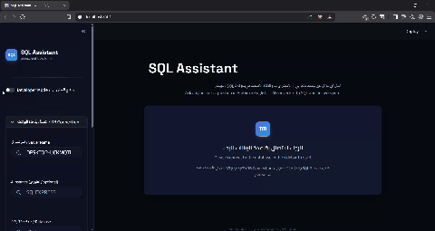

# 💬 SQL Assistant — Technical Reference

## Overview

The SQL Assistant is an AI-powered Business Intelligence agent that connects to Microsoft SQL Server, auto-discovers the Gold schema, and converts natural language questions (English or Arabic — including Egyptian dialect) into T-SQL `SELECT` queries using Google Gemini.

🎬 **Demo:**



---

## Features

| Feature | Details |
|---------|---------|
| 🧠 **Bilingual AI** | Supports English and Arabic (Egyptian dialect) natively |
| 🔒 **4-Layer Security** | Blocks all DDL/DML before any DB contact |
| 📐 **Auto Schema Discovery** | Tables, views, columns, PKs, FKs — no manual config |
| 📊 **Smart Visualization** | Auto-selects bar / line / pie / scatter / KPI / table |
| 💬 **Conversational Context** | Full chat history with follow-up question support |
| 🛠 **Developer Mode** | Editable SQL editor, validate, explain, re-run |
| 📤 **Export** | Download results as CSV or Excel |
| 🔄 **Model Fallback Chain** | Automatically tries backup Gemini models on quota exhaustion |

---

## Architecture

```
User Question (Arabic/English)
          │
          ▼
┌─────────────────────────┐
│   schema.py             │  Auto-discovers Gold schema
│   (Schema Discovery)    │  tables, columns, PKs, FKs, row counts
└────────────┬────────────┘
             │ schema_context (string)
             ▼
┌─────────────────────────┐
│   ai_service.py         │  Gemini API call with system prompt
│   (Gemini Integration)  │  Returns JSON: {sql, explanation, chart, confidence}
└────────────┬────────────┘
             │ generated SQL
             ▼
┌─────────────────────────┐
│   security.py           │  4-layer validation
│   (SQL Validator)       │  Blocks all non-SELECT queries
└────────────┬────────────┘
             │ validated SQL
             ▼
┌─────────────────────────┐
│   database.py           │  SQLAlchemy + pyodbc execution
│   (Query Executor)      │  Returns DataFrame + elapsed time
└────────────┬────────────┘
             │ results
             ▼
┌─────────────────────────┐
│   visualization.py      │  Plotly chart auto-detection
│   (Chart Renderer)      │  + manual override dropdown
└─────────────────────────┘
             │
             ▼
          app.py (Streamlit UI)
```

---

## Module Reference

### `app.py` — Streamlit Application

Main entry point. Handles:
- Sidebar connection form (Windows Auth / SQL Auth)
- AI Settings (model selection, auto-explain toggle)
- Question input bar with auto-trigger on change
- Results display (business insights card, SQL editor, data table, visualization)
- Developer Mode toggle (shows technical details, SQL editor, schema explorer)
- Chat history (last 6 turns passed as context to Gemini)

**Key session state variables:**

| Variable | Type | Description |
|----------|------|-------------|
| `db_connected` | bool | Whether SQL Server is connected |
| `db_engine` | Engine | SQLAlchemy engine object |
| `schema` | dict | Discovered schema (tables, columns, PKs, FKs) |
| `schema_context` | str | Formatted schema string for Gemini prompt |
| `chat_history` | list | Conversation turns [{role, content, ts, lang}] |
| `last_sql` | str | Most recently generated SQL |
| `last_df` | DataFrame | Most recently returned data |
| `last_ai_result` | dict | Full AI response for display |

---

### `ai_service.py` — Google Gemini Integration

Converts natural language questions to T-SQL using the `google-genai` SDK.

#### `generate_sql(question, schema_context, model, ...)`

| Parameter | Default | Description |
|-----------|---------|-------------|
| `question` | required | The user's question (Arabic or English) |
| `schema_context` | required | Auto-discovered schema as formatted string |
| `model` | `gemini-2.0-flash` | Primary model name |
| `max_tokens` | 2048 | Max output tokens |
| `temperature` | 0.1 | Low temperature for consistent SQL |
| `chat_history` | None | List of previous turns for conversational context |

**Returns:** Dict with keys:
- `sql` — The T-SQL SELECT query
- `sql_explanation` — Step-by-step explanation in the user's language
- `business_explanation` — Plain-language business meaning
- `chart_suggestion` — One of: bar, line, pie, scatter, table, kpi
- `confidence` — Integer 0–100
- `detected_language` — "arabic" or "english"
- `model_used` — Which Gemini model actually responded
- `error` — None on success, error message string on failure

**Model fallback chain:** If the primary model returns a quota error (429), the service automatically tries the next model in the chain:
```python
_MODEL_CHAIN = [
    "models/gemini-2.5-flash-lite",   # Primary — separate quota pool
    "models/gemini-2.5-flash",
    "models/gemini-2.0-flash",
    "models/gemini-2.0-flash-lite",
    ...
]
```

**T-SQL Auto-fixer (`_fix_sql`):** Automatically corrects two common Gemini mistakes with Arabic column aliases:
1. `AS 'alias'` → `AS [alias]` (single-quoted aliases are invalid T-SQL)
2. `ORDER BY 'alias'` → `ORDER BY <ordinal position>` (aliases not visible in ORDER BY in SQL Server)

---

### `security.py` — SQL Safety Validation

All generated SQL passes through 4 sequential validation checks:

#### Layer 1: Comment Stripping
```python
# Remove /* */ and -- comments to prevent hiding keywords inside comments
sql = re.sub(r"/\*.*?\*/", " ", sql, flags=re.DOTALL)
sql = re.sub(r"--[^\n]*", " ", sql)
```

#### Layer 2: Multi-statement Blocker
```python
# Reject any SQL containing a semicolon (query chaining attack)
statements = [s.strip() for s in normalised.split(";") if s.strip()]
if len(statements) > 1:
    return ValidationResult(False, "Multiple statements not allowed")
```

#### Layer 3: First-token Whitelist
```python
ALLOWED_STARTERS = ["SELECT", "WITH"]
first_token = query.split()[0].upper()
if first_token not in ALLOWED_STARTERS:
    # Blocked — query must start with SELECT or WITH (CTE)
```

#### Layer 4: Keyword Blocklist Scan
```python
BLOCKED_KEYWORDS = [
    "INSERT", "UPDATE", "DELETE", "DROP", "ALTER", "TRUNCATE",
    "CREATE", "EXEC", "EXECUTE", "MERGE", "GRANT", "REVOKE",
    "BULK", "OPENROWSET", "OPENQUERY", "RESTORE", "BACKUP",
    "SHUTDOWN", "KILL", "WAITFOR", "XP_", "SP_",
]
# Each keyword checked with word-boundary regex: \bKEYWORD\b
```

**Defense in Depth:** Even if all 4 code layers somehow pass a malicious query, the recommended database account (`db_datareader` role) physically cannot execute any write operations.

---

### `schema.py` — Auto Schema Discovery

**`discover_schema(engine)`** — Queries SQL Server system views to build a complete schema map:

```sql
-- Tables and views in 'gold' schema
SELECT TABLE_NAME, TABLE_TYPE FROM INFORMATION_SCHEMA.TABLES WHERE TABLE_SCHEMA = 'gold'

-- All columns with types
SELECT COLUMN_NAME, DATA_TYPE, IS_NULLABLE FROM INFORMATION_SCHEMA.COLUMNS WHERE TABLE_SCHEMA = 'gold'

-- Primary keys
SELECT ... FROM INFORMATION_SCHEMA.KEY_COLUMN_USAGE ...

-- Foreign keys
SELECT ... FROM INFORMATION_SCHEMA.REFERENTIAL_CONSTRAINTS ...

-- Row counts (approximate, from sys.dm_db_partition_stats)
SELECT SUM(row_count) FROM sys.dm_db_partition_stats ...
```

**`build_schema_context(schema)`** — Formats the discovered schema into a compact string for the Gemini prompt, covering table names, column types, PKs, FKs, and row counts.

---

### `database.py` — SQL Server Connection & Query Execution

**`create_db_engine(config)`** — Tries all available ODBC SQL Server drivers in order (prefers Driver 17, then 18), returns `(engine, None)` on success or `(None, error_message)` on failure.

**`run_query(engine, sql, timeout=60)`** — Executes validated SQL with a query governor cost limit. Returns `(DataFrame, elapsed_seconds, None)` on success.

---

### `visualization.py` — Chart Auto-detection

**`detect_chart_type(df, hint)`** — Uses chart hint from AI response + DataFrame shape analysis to pick the best Plotly chart:

| Condition | Auto-selected chart |
|-----------|-------------------|
| 1 numeric column, 1 row | `kpi` |
| hint = "pie" and ≤ 8 categories | `pie` |
| hint = "line" and datetime column | `line` |
| 2+ columns, 1 numeric | `bar` |
| 2+ numeric columns | `scatter` |
| fallback | `table` |

---

## Running the SQL Assistant

```bash
# From project root
pip install -r sql_assistant/requirements.txt

# Run
streamlit run sql_assistant/app.py
```

Opens at: `http://localhost:8501`

### Environment variables

The app reads credentials from the root `.env` file. Required:

```env
Gemini_API_Key=your_gemini_api_key     # or GEMINI_API_KEY or GOOGLE_API_KEY
DEST_DB_HOST=your_sql_server_hostname  # Pre-fills the connection form
DEST_DB_NAME=BI_AI
DEST_DB_TRUSTED_CONNECTION=yes
```

---

## Example Questions

**English:**
- "What are the top 10 products by total revenue?"
- "Show monthly sales trends for 2018"
- "Which customers have not placed an order in the last 90 days?"
- "What is the average review score by product category?"
- "Which sellers have the highest on-time delivery rate?"

**Arabic (Egyptian dialect):**
- "وريني الجداول الموجودة في الـ gold schema وعدد الصفوف في كل جدول"
- "ايه أعلى 10 منتجات من حيث المبيعات؟"
- "مين العملاء اللي عندهم أعلى قيمة شراء؟"
- "عايز أشوف توزيع درجات التقييم"
- "ايه أكتر طريقة دفع بتتستخدم؟"

---

## Developer Mode

Toggle **Developer Mode** in the sidebar to unlock:

1. **SQL Editor** — Edit the AI-generated SQL directly in a text area
2. **Validate** — Run security check on any SQL without executing
3. **Run** — Execute edited SQL
4. **Explain** — Generate plain-language explanation via Gemini
5. **Schema Explorer** — Browse all Gold tables and columns
6. **Chat History** — View previous questions and answers
7. **Technical Details** — Confidence %, execution time, model used, row/column counts
